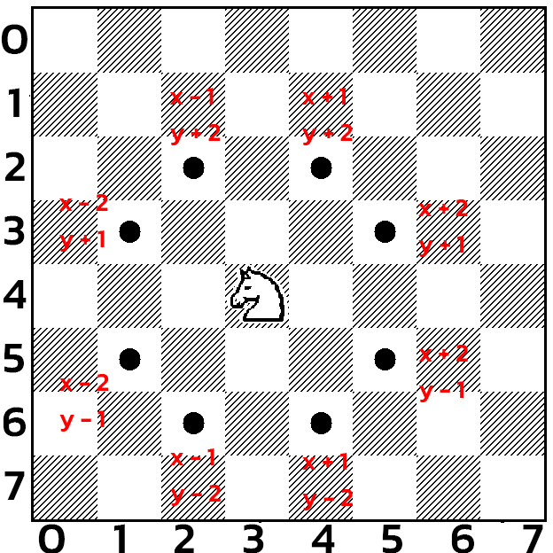

# knights-travails

##My attempt to solve the knights travails problem

## Thinking out loud

* At any point, the maximum number of unique moves that can be made by a knight is 8
* Moving back to the same spot while going on a path is useless
* Data structure: A directed unweighted graph that holds all the possible moves at a certain position
* The shortest path is traced using a modified Breadth first algorithm (modifed as in traces the path not only searching")

* A knight's possible moves at any position all follow the same pattern
